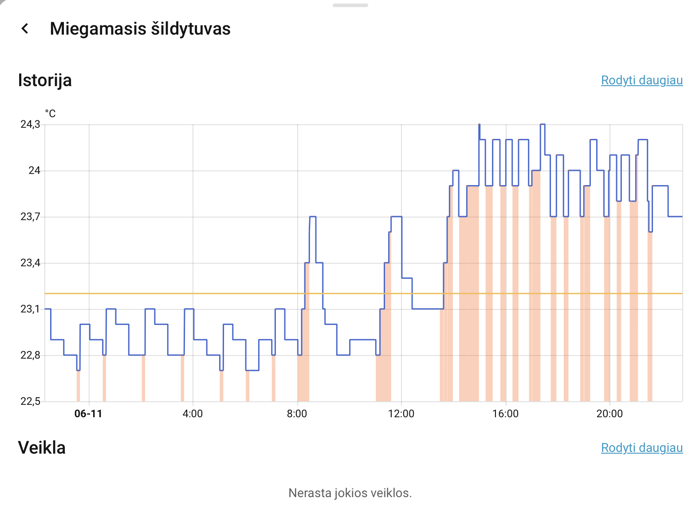

# Real World Case Study

## Environment

- Bedroom located on the north side of an older house
- Infrared heater used as the primary night-time heating source
- Home Assistant
- Moes TS0201 Zigbee temperature sensor (0.1 °C resolution)
- Aqara Smart Plug H2 EU
- Home Assistant Generic Thermostat

## Problem

The infrared heater produced noticeable clicking and cracking sounds caused by thermal expansion and contraction during frequent ON/OFF switching cycles.

This became especially noticeable during night-time operation and negatively affected sleeping comfort.

Standard thermostat control resulted in unnecessary switching events due to small temperature fluctuations.

## Solution

A custom Home Assistant automation called **Silent Night IR Heater Pack** was developed.

The solution uses:

- Smart hysteresis control
- High-resolution temperature monitoring
- Adjustable ON and OFF thresholds
- Night-time operating schedule
- Home Assistant automation engine

The automation turns the heater ON only when the temperature falls below the configured lower threshold and turns it OFF only after reaching the configured upper threshold.

This significantly reduces unnecessary switching cycles.

## Generic Thermostat Integration
### Dashboard Example

The custom hysteresis automation was integrated with Home Assistant Generic Thermostat to provide a user-friendly climate control interface, temperature history tracking and simple daily operation.
To provide a user-friendly climate interface, the project was integrated with Home Assistant Generic Thermostat.

Components used:

- Generic Thermostat helper
- Moes TS0201 temperature sensor
- Aqara Smart Plug H2 EU
- Silent Night hysteresis automation

Benefits:

- Visual thermostat dashboard
- Adjustable target temperature
- Climate entity integration
- Temperature history tracking
- Improved user experience
- Easy daily operation without editing automations

## Results

After implementation:

- More stable room temperature
- Fewer heater switching cycles
- Reduced clicking noise
- Improved sleeping comfort
- Better overall user experience
- Cleaner climate control interface
- Successful integration with Home Assistant Generic Thermostat
## Technical Highlights

- Home Assistant Automation
- Generic Thermostat
- Zigbee Temperature Monitoring
- Aqara Smart Plug Integration
- Smart Hysteresis Logic
- HVAC Control
- Home Assistant Dashboard Integration

## Future Improvements

Planned future enhancements:

- Presence-aware heating control
- Bedroom occupancy detection
- Energy consumption monitoring
- Adaptive heating schedules
- AI-assisted temperature optimization

## Conclusion

The Silent Night IR Heater Pack demonstrates how a simple Home Assistant automation combined with Generic Thermostat can significantly improve comfort, reduce heater noise and create a more stable heating environment.

This project is a practical example of applying smart home automation to solve a real-world comfort problem using affordable consumer hardware and Home Assistant.
